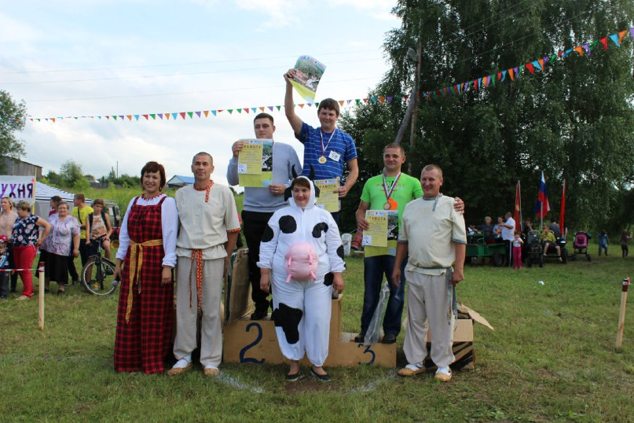

Ежегодный турнир "Веселый коровяк" - по метанию коровьих лепешек на дальность - прошел 8-9 июля в селе Крылово Осинского района Пермского края.

Участники соревнований кидают "снаряд" - спрессованный навоз, выбирая его из заранее заготовленной кучи. Желающих поупражняться в силе броска традиционно очень много - как мужчин, так и женщин. Каждую лепешку, которую метнули участники "Веселого коровяка", внимательно осматривали женщины в костюмах коров и тщательно замеряли расстояние.

Соревнования по метанию коровьих лепешек проводятся в Пермском крае с 2009 года.

К сожалению, после чемпионата потерялись записи с фамилиями участников, остались только записи о длине броска в том порядке, в котором их совершали участники.

Трактиорист Василий помнит три факта:

1) Число метров, на которое он метнул лепешку, оканчивалось на 5

2) Один из победителей чемпионата метал лепешку до Василия

3) Участник, метавший лепешку сразу после Василия, метнул ее на меньшее количество метров

Будем считать, что участник соревнования занял k-е место, если ровно (k − 1) участников чемпионата метнули лепешку строго дальше, чем он.

Какое максимально высокое место мог занять Василий?

## Формат ввода

Первая строка входного файла содержит целое число n — количество участников чемпионата по метанию лепешек (3 ≤ n ≤ 105).

Вторая строка входного файла содержит n положительных целых чисел, каждое из которых не превышает 1000, — дальность броска участников чемпионата, приведенные в том порядке, в котором происходило метание.

## Формат вывода

Выведите самое высокое место, которое мог занять тракторист Василий. Если не существует ни одного участника чемпионата, который удовлетворяет, описанным выше условиям, выведите число 0.
