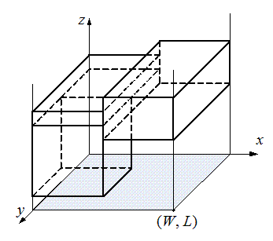

Над ареной огромного спортивного комплекса Независимого Главного Университета (НГУ) решили построить перекрытие. Перекрытие будет построено по клеевой технологии и состоять из склеенных друг с другом блоков. Блок представляет собой легкий прямоугольный параллелепипед. Два блока можно склеить, если они соприкасаются перекрывающимися частями боковых граней ненулевой площади.

НГУ представил план комплекса, имеющий вид прямоугольника размером W на L. При этом один из углов прямоугольника находится в начале системы координат, а другой имеет координаты (W, L). Стены комплекса параллельны осям координат.

Подрядчики известили НГУ, что они готовы к определенному сроку изготовить блоки и установить их. Для каждого блока фиксировано место его возможного монтажа, совпадающее по размерам с этим блоком. Места выбраны так, что ребра блоков параллельны осям координат. Места монтажа блоков не пересекаются.

По техническим условиям перекрытие должно состоять из такого набора склеенных блоков, который содержит сплошной горизонтальный слой ненулевой толщины. Торопясь ввести комплекс в эксплуатацию, НГУ решил построить перекрытие из минимально возможного числа блоков.

Требуется написать программу, которая позволяет выбрать минимальное число блоков, которые, будучи установленными на указанных подрядчиками местах, образуют перекрытие, либо определить, что этого сделать невозможно. Высота, на которой образуется перекрытие, не имеет значения.

## Формат ввода

В первой строке входного файла указаны три целых числа: N — количество возможных блоков (1 ≤ N ≤ 10^5) и размеры комплекса W и L (1 ≤ W, L ≤ 10^4). Каждая из последующих N строк описывает место монтажа одного блока, определяемое координатами противоположных углов: (x1, y1, z1) и (x2, y2, z2), при этом 0 ≤ x1 < x2 ≤ W, 0 ≤ y1 < y2 ≤ L, 0 ≤ z1 < z2 ≤ 10^9. Все числа во входном файле целые и разделяются пробелами или переводами строк.

Гарантируется, что места установки блоков не пересекаются друг с другом.

## Формат вывода

Первая строка выходного файла должна содержать либо слово «YES», если перекрытие возможно построить, иначе — слово «NO». В первом случае вторая строка выходного файла должна содержать минимальное число блоков, образующих перекрытие, а последующие строки — номера этих блоков, в соответствии с порядком, в котором они перечислены во входном файле.

Если возможно несколько минимальных наборов блоков, выведите любой из них.
